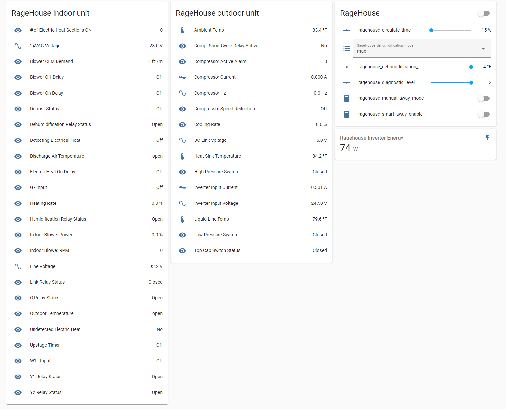
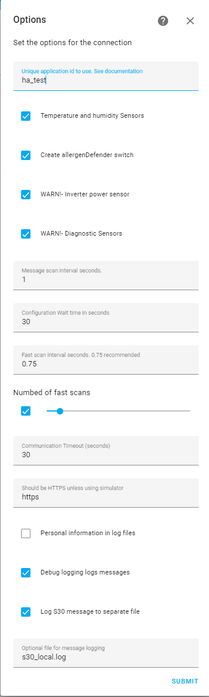
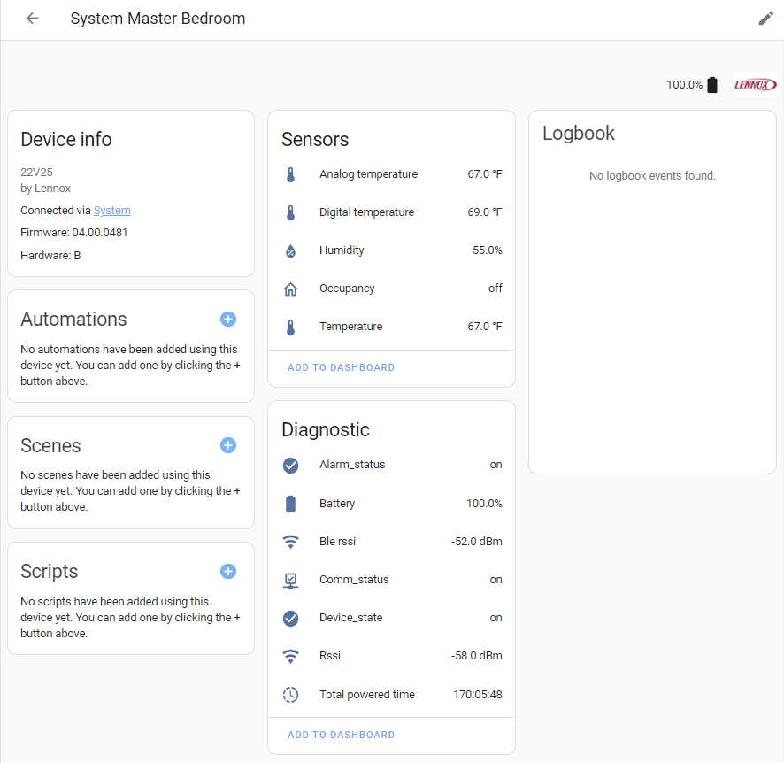
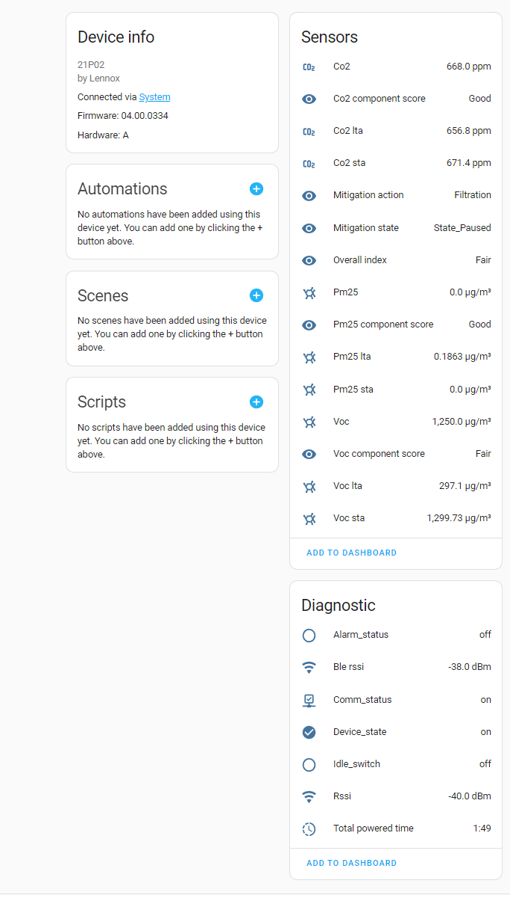

# Lennox S40/S30/E30/M30 Component

A custom component for Home Assistant to integrate with Lennox iComfort S40, S30, E30 or M30 thermostats; supporting local LAN connections and Lennox
Cloud Connections depending on the device model. We believe these configurations work - let us know if your experience is different!

| Device Type | Local Connection | Cloud Connection |
| ----------- | ---------------- | ---------------- |
| S30         | Yes              | Yes              |
| S40         | Yes              | Unknown          |
| E30         | Yes              | Yes              |
| M30         | No               | Yes              |

> **Please Note:** This component **does not** support the other models of Lennox Thermostats.

# Requirements

- Home Assistant >= 2023.3.0
- Thermostat linked to a lennoxicomfort.com account or a Thermostat on local LAN with a static/ DHCP leased IP address

# Important Information

- Note: Where we mention S30 in this documentation that also applies to S40, E30 and M30
- If you are having problems with your S40 - please make sure you have software version 04.25.0070 or greater installed. You also may need to shutdown HA and reboot the thermostats in order to establish a connection.
- It is recommended to disable automatic software updates on the Thermostat. This will prevent outages if new versions are not compatible with this integration.
- If using a local connection and you have more than one S30 in your local network, please use a different app_id for each instance (e.g. homeassistant_1, homeassistant_2). If using a Cloud Connection DO NOT change the default app_id.
- If you are running more than 1 Home Assistant communicating to cloud or locally - you _MUST_ use a different _app_id_ for each instance - [Detailed Configuration](#Detailed-Configuration-Parameters)
- **WARNING** If using the Power Inverter or Diagnostic Sensors - S30 stability problems may arise if your system is connected to the Lennox Cloud. Please review [docs/diagnostics.md](./docs/diagnostics.md) before using.
- Equipment Parameters - documentation is here [docs/parameters.md](./docs/parameters.md)
- Passwords with special characters are not properly supported by the Lennox Cloud API and may not work. Known special characters that cause issues are & and ^. If your password contains these characters you may need to change it prior to using the integration.
- Adjusting the fan CFM in a single zone system causes some diagnostics to stop updating. Changing the diag_level to 0 and back to 2 solves the issue. A script is available [here](./samples/set_fan_cfm)
- A power outage to the Lennox Controller causes the diag_level to be reset to 0 on reboot. An automation/package is available [here](./samples/diaglevel) to automatically reset.
- If you add new equipment (BLE Sensors), restart HA in order for the integration to pickup the new equipment.

# Planning your install

There are several items to consider before starting the install.

- Set the Name for the system. This name will be appended as the prefix for all the entities that get created, so you want something descriptive using only alphanumeric character; but not too long as it'll be in all the entity names. To set this, go into the panel, select settings and look for the **Name** field.

# Overview

This image shows the main entities and controls available for the Lennox S30 integration. Specific entity documentation appears later in this document.


This image shows diagnostic data being collected from the **RageHouse** Lennox S30 system with an Air Handler and Outdoor Compressor



# Donations

If you like this integration

[](https://www.buymeacoffee.com/PeteRage)

# Installation

## HACS

HACS is recommended as it provides automated install and will notify you when updates are available.

This assumes you have [HACS](https://github.com/hacs/integration) installed and know how to use it. If you need help with this, go to the HACS project documentation.

As of October 2023, this integration is included in the HACS default configuration.

## Manually

1. Go to [releases](https://github.com/PeteRager/lennoxs30/releases) in this repo and download the latest zip or clone the repo
1. Extract the zip file and copy the `custom_components/lennoxs30` folder and all it's contents including the `translations` subfolder, into the `custom_components` folder in your HA installation. If upgrading from a prior release, please remove ALL files from this folder.
1. Restart HA.
1. Follow the Configuration Instructions below

# Configuration

Configuration of the integration is done within the Integrations Panel in Home Assistant.

1. Click on Configuration, then Integrations
1. Click _Add Integration_
1. Search for Lennox S30/E30

## Select Cloud or Local

The first step is to select a Cloud or a Local connection.

Most, will use the Local Connection. Local connections are faster and more reliable than Cloud Connections. To have this work requires that the S30 has a static IP address (DHCP lease), consult your router documentation for how to configure this.

Why would you use a Cloud Connection? Perhaps you want to monitor your vacation home in the Alps? Or your parent's house?

Need both or have multiple S30s? You are able to run multiple local and multiple cloud connections at the same time. Each is configured using this process.

1. Select Cloud or Local (default) connection

## Local Configuration

The next step is providing the connection information.

1. Enter the IP address of the S30. Alternatively, you can use a DNS name. If you have firewalls and do port mapping you may specify the port (hostname:port or ip:port) By default the S30 exposes HTTPS on Port 443.
1. You can use the defaults for the rest of the fields, or adjust as needed. See detailed configuration parameters below. Configuration can be changed later when needed. See [Detailed Configuration](#Detailed-Configuration-Parameters)
1. Submit the form

At this point, the integration will attempt to connect to the S30 - this should take no more than 5-10 seconds. If it succeeds, the Advanced Configuration Page will appear. If it is unable to connect errors will be reported and detailed information will be in the Home Assistant log file. Go onto the Advanced Configuration section.

## Cloud Connection

If using a cloud connection. The next step is to specify the connection information.

1. Enter the email address associated with your Lennox iComfort account
1. Enter the password associated with your Lennox iComfort account
1. Use the defaults for the rest of the fields, or adjust as needed. See [Detailed Configuration](#Detailed-Configuration-Parameters)
1. Submit the form

At this point, the integration will attempt to connect to the S30 - this should take no more than 5-15 seconds. If it succeeds, the Advanced Configuration Page will appear. If it is unable to connect errors will be reported and detailed information will be in the Home Assistant log file. Go onto the Advanced Configuration section.

## Advanced Configuration

The next page brings up advanced configuration properties with the recommended defaults.

1. Use the defaults (recommended) or adjust using the [Detailed Configuration](#Detailed-Configuration-Parameters)
1. Press submit

At this point, the integration will connect to the S30, download and process its configuration (100kb) and create the Entities in Home Assistant. For local connections, this step typically takes 10-30 seconds complete, for cloud connections it an takes 15-45 seconds. If it is successful, you will be presented with a list of discovered devices. If it fails, review the error and look in the log file for more detailed information.

For Local Connections the Integration instance name is the ip_address / host name. For Cloud Connections the instance name is a redacted version of your email.



# Configuration Options

If you want to change the integration configuration, do into the integrations page, find the integration and click configure. This will bring up the set of options you can change. After saving, select Reload or Restart HA for the changes to take affect.

# Temperature Units (Celsius, Fahrenheit)

The integration detects the unit system configured in Home Assistant and reports the data in the correct units. Celsius is in 0.5 degree increments. Fahrenheit is in 1.0 degrees increments. The Lennox API delivers data in both units, so there is no conversion in the Integration and what you see in the Lennox UI should be what you see in HA.

# Homeassistant Scripts and automation samples

Samples of useful automations and scripts can be found in the [samples/](./samples/) directory. If you have some you'd like included, open a pull request.

# Devices

The integration will create a full set of devices representing your HVAC system. Note: depending on your HVAC configuration and the configuration options not all devices may have entities. Please don't delete the unused devices, they will be used as we add more entities in future releases

| Device Type  | Description                                                                                           | Name                           | Parent |
| ------------ | ----------------------------------------------------------------------------------------------------- | ------------------------------ | ------ |
| S30          | This is the HVAC controller, it is a little box with an antenna located near the indoor unit.         | S30 System Name                | None   |
| Indoor Unit  | This specifies the type of indoor unit you have. Examples, include `Furnace` and `Air Handler`.       | S30 System Name + Outdoor Unit | S30    |
| Outdoor Unit | This specifies the type of outdoor unit you have. Examples include `Heat Pump` and `Air Conditione`r. | S30 System Name + Indoor Unit  | S30    |
| Thermostat   | One thermostat device is created for each zone. These are mounted on the walls in your house.         | S30 System Name + Zone Name    | S30    |

# Entities

## Climate

_Cloud_ - Automatically detects all the zones across the homes and systems in your cloud account. Climate Entities created for each zone. The integration creates internal unique_ids using the Cloud GUID of your S30 plus the zone index (0,1,2,3).

_Local_ - Automatically detects all the zones in the S30 it is connected to. Climate Entities created for each zone. The integration creates internal unique_ids using the Serial Number of your S30 plus the zone index (0,1,2,3).

Entities are attached to the corresponding S30 Device and have default names (which you can change in Home Assistant)

_climate.<system*name>*<zone_name>_

System name is the name you gave to your S30. By default Lennox names the Zones - "Zone 1", "Zone 2", "Zone 3", "Zone 4" - this is configurable within the S30.

### Supported operations

**HVAC_MODE** supports **off**, **cool**, **heat** or **heat_cool** mode. The specific modes available depend on you equipment. For example an AC does not support heat, hence the heat and heat_cool modes will not be available.

**FAN_MODE** may be set to **auto**, **on**, **circulate**.

**Heating** and **cooling** setpoints can be set

**Presets** are supported. The Preset List is the list of schedules that you have configured in the S30.

When you are running a schedule; changes to the temperature or fan create a temporary schedule override (the Mobile APP does the same thing). The override will automatically end at the end of the Next Period (e.g. at the time of your next schedule period.) To cancel the override, there is a preset called **Cancel Hold**. Invoking this preset will remove the hold and re-enable the underlying schedule.

Away Mode. The **Away** preset will put the S30 system into Manual Away Mode. You could also use the manual away mode switch to do this. Works the same as if you pressed the away button on the S30 Panel

Cancel Manual Away Mode or Smart Away Mode. The **cancel away mode** preset will cancel the active away mode (manual or smart) and return the S30 system to whatever state it was in prior to putting it into away mode. This works the same as if you pressed the cancel away icon on the S30 panel.

**Emergency Heat** - Lennox systems that have a heat pump and an auxiliary furnace, have an additional HVAC_MODE to run just the auxiliary furnace. In the S30 App this is shown as Emergency Heat. Home Assistant **does not** allow this mode directly - instead a **select.system_zone_hvac_mode** entity provides support for setting the hvac mode to emergency heat. The integration has the following behavior:

- If Emergency Heat Mode is set in the S30, the HA climate will show Heat and the select entity will show **Emergency Heat**.
- If the Lennox Auxiliary Heat is running, the **aux** attribute in the HA Climate entity will be set to True and the HA Climate Entity will show **Heating**

**Humidification and Dehumidification**

Lennox systems may have humidification and dehumidification capability. If so, you will be able to control the humidity setpoint via the Climate Entity and enable / disable humidification/dehumidification via the [humidity mode select entity](#Humidity-Mode). Lennox has separate setpoints for humidification (husp) and dehumidification (desp); however Home Assistant only support one humidity setpoint. Hence, the **Target Humidity** shown in Thermostat is based on the active humidity mode. If no humidity mode is active for the zone, the Target Humidity will be unavailable.

### Supported Data

The integration provides all of the standard climate attributes, including

1. Temperature
2. Humidity
3. Current HVAC action
4. Active setpoints - dependent on the HVAC_MODE. For example, in Cool Mode the Cool Setpoint is shown, but not the Heat Setpoint.
5. Active Preset

In addition the following extra attributes are provided, to allow for a more detailed information on the current zone operation.

| Attribute Name    | Description                                                                                                                                                                                                                                                                                                                                                                                                                                                                                                  |
| ----------------- | ------------------------------------------------------------------------------------------------------------------------------------------------------------------------------------------------------------------------------------------------------------------------------------------------------------------------------------------------------------------------------------------------------------------------------------------------------------------------------------------------------------ |
| allergenDefender  | Indicates if this is enabled on the zone                                                                                                                                                                                                                                                                                                                                                                                                                                                                     |
| aux               | Auxiliary Heating is On when True, off when False. Typically this means the hest pump is disabled and the furnace is running instead.                                                                                                                                                                                                                                                                                                                                                                        |
| balancePoint      | This is related to heatpump lockout, details / values are not well known yet - if you know let us know!                                                                                                                                                                                                                                                                                                                                                                                                      |
| coolCoast         | This will only appear in non-zoning systems and it indicates the system is set to a single setpoint mode, the system was in heating mode and has turned off to coast to the desired temperature                                                                                                                                                                                                                                                                                                              |
| damper            | Position of damper - range 0-100. Observationally values are either 0 or 100; where 100 = damper open.                                                                                                                                                                                                                                                                                                                                                                                                       |
| defrost           | Defrost is active                                                                                                                                                                                                                                                                                                                                                                                                                                                                                            |
| demand            | % of maximum CFM of air demand for the zone. Value is 0-100                                                                                                                                                                                                                                                                                                                                                                                                                                                  |
| fan               | Indicates if the fan is currently running. Note: this is true only when the fan is running and there is no active HVAC action (cooling, heating, etc.)                                                                                                                                                                                                                                                                                                                                                       |
| heatCoast         | This will only appear in non-zoning systems and it indicates the system is set to a single setpoint mode, the system was in heating mode and has turned off to coast to the desired temperature                                                                                                                                                                                                                                                                                                              |
| humOperation      | Current active humidity operation - **Waiting**,**Humidifying**, **Drying** or **Off**                                                                                                                                                                                                                                                                                                                                                                                                                       |
| ssr               | When enabled, smooth set back begins recovery up to two hours before the programmed time so that the programmed temperature is reached at the corresponding programmed event time. Assume 12°F (6.72°C) per hour for first-stage gas/electric heating and 6°F (3.36°C) per hour for first-stage compressor based heating or cooling.With Smooth Set Back disabled, the system will start a recovery at the programmed time. Options are enabled or disabled. Default is enabled. See manual for more details |
| tempOperation     | Current active temperature operation heating or cooling                                                                                                                                                                                                                                                                                                                                                                                                                                                      |
| ventilation       | Indicates if external ventilation is currently active on this zone                                                                                                                                                                                                                                                                                                                                                                                                                                           |
| zoneEnabled       | Indicates if the zone is currently enabled. When in a multi-zone system, disabling iHarmony Zoning, turns the system into a single zone system controlled by Zone 1. The other climate entities are disabled except for reporting Ambient Temperature and Humidity                                                                                                                                                                                                                                           |
| zoningMode        | The system zoning mode - **central** or **zoned**                                                                                                                                                                                                                                                                                                                                                                                                                                                            |

## lennoxs30.state or lennoxs30.conn\_\<hostname\> or lennoxs30.\_<redacted email_address\>

These entities is automatically created for each integration instance and can be used to track the state and health of the Cloud or Local connection to the S30. When using multiple LAN connections, the
first host in the list will use **lennoxs30.state** for backwards compatibility. Additional local connections will use a naming convention of **lennoxs30.conn\_<hostname>**. Cloud connections wil use lennoxs30.\_<redacted email_address\>

| State            | Description                                                                                               |
| ---------------- | --------------------------------------------------------------------------------------------------------- |
| Connected        | API is connected. This is the desired state                                                               |
| Connecting       | API is trying to connect                                                                                  |
| Disconnected     | API has failed to connect and will not try again. Please raise an issue if you encounter this state       |
| Login Failed     | The login failed due to bad email/password combination. Please correct credentials and reload integration |
| Waiting to Retry | The API was unable to connect or lost connection and is waiting to attempt a retry                        |
| Failed           | The API failed. Please raise an issue if you encounter this state                                         |

The entity also has a set of attributes to provide diagnostic data:

| Attribute              | Type     | Description                                                                                                                                                                                                                                                             |
| ---------------------- | -------- | ----------------------------------------------------------------------------------------------------------------------------------------------------------------------------------------------------------------------------------------------------------------------- |
| message_count          | int      | number of messages received from Lennox Cloud                                                                                                                                                                                                                           |
| send_count             | int      | number of messages sent                                                                                                                                                                                                                                                 |
| receive_count          | int      | number of queries to receive new messages. Most queries return no messages                                                                                                                                                                                              |
| bytes_in               | int      | number of bytes received                                                                                                                                                                                                                                                |
| bytes_out              | int      | number of bytes sent                                                                                                                                                                                                                                                    |
| error_count            | int      | number of errors                                                                                                                                                                                                                                                        |
| http_2xx               | int      | number of HTTP responses received between 200-299. These are good responses                                                                                                                                                                                             |
| http_4xx               | int      | number of HTTP responses received between 400-499. These usually indicate a problem with authorization                                                                                                                                                                  |
| http_5xx               | int      | number of HTTP responses received between 500-599. These indicate a problem with the Cloud or S30. Seeing a few of these a day is normal                                                                                                                                |
| timeouts               | int      | number of communication timeouts. These may happen daily for local connections when the S30 network stack does a daily reset. Typically you will see a timeout or a server_disconnect, followed by a client_response_error                                              |
| client_response_errors | int      | number of client response errors. These may happen daily for local connections when the S30 network stack does a daily reset.                                                                                                                                           |
| server_disconnects     | int      | number of server disconnects. These may happen daily for local connections when the S30 network stack does a daily reset.                                                                                                                                               |
| connection_errors      | int      | number of connection errors. These indicate the destination - local or cloud - was unreachable. This may indicate a network issue.                                                                                                                                      |
| last_receive_time      | DateTime | Time of last successful receive. Should not be more than SCAN_INTERVAL seconds plus few seconds plus the metric update interval (90 seconds). In other words is this time is more than 5 minutes ago using default SCAN_INTERVAL something is wrong.                    |
| last_error_time        | DateTime | Time of the last error response                                                                                                                                                                                                                                         |
| last_reconnect_time    | DateTime | Time of the last reconnect or the time of the initial connect                                                                                                                                                                                                           |
| last_message_time      | DateTime | Time of the last message from Lennox Cloud. How often messages are received is based on how often data is changing in the thermostat. For example, a temperature change, a setpoint change will cause a message to be sent. If nothing is changing nothing will be sent |
| sender_message_drop    | int      | Number of messages dropped due to invalid sender. This should be zero. Please check error log.                                                                                                                                                                          |
| sibling_message_drop   | int      | Number of messages dropped from a sibling S30. S30s can be chained together to create a larger system. When this occurs each S30 also sends messages from the other S30. The integration drops these messages are they are not needed.                                  |
| sysUpTime              | int      | Number of seconds the S30 has been running since last reboot. Note: for cloud connections this is updated once at startup. For local connections this updates every minute.                                                                                             |
| diagLevel              | int      | Current Diagnostic Level of the S30. By default this is zero, if using the power diagnostics this should be 1 or 2                                                                                                                                                      |
| softwareVersion        | string   | Current software version of the S30                                                                                                                                                                                                                                     |
| hostname               | string   | The hostname used by this connection or None if a cloud connection                                                                                                                                                                                                      |
| sibling_id             | string   | The ID of the sibling or None if no sibling                                                                                                                                                                                                                             |
| sibling_ip             | string   | The IP address of the sibling or None if no sibling                                                                                                                                                                                                                     |

## S40 Remote Sensors

The S40 supports the use of remote sensors. Bluetooth Low Energy (BLE) is the technology used for the sensor to communicate with the panel. Currently, we have only seen one type of sensor (22V25); if your system has other types of sensors, please open an issue so we can add support.

### 22V25 - BLE Smart Room Sensor

The 22V25 is a battery powered room sensor.



| Entity Type   | Name                | Description                                                                                                            |
| ------------- | ------------------- | ---------------------------------------------------------------------------------------------------------------------- |
| sensor        | Analog Temperature  | Provides the analog temperature. It is not clear what the different is between this and the other temperature sensors  |
| sensor        | Battery             | The battery level in %                                                                                                 |
| sensor        | Ble rssi            | Signal Strength. Unclear what this is vs rssi                                                                          |
| sensor        | Digital Temperature | Provides the digital temperature. It is not clear what the different is between this and the other temperature sensors |
| sensor        | Humidity            | Provides the relative humidity                                                                                         |
| sensor        | Rssi                | Signal Strength. Unclear what this is vs ble_rssi                                                                      |
| sensor        | Temperature         | Provides the temperature                                                                                               |
| sensor        | Total Powered Time  | Time in seconds the device has been powered                                                                            |
| binary_sensor | Alarm Status        | Unknown - need info                                                                                                    |
| binary_sensor | Comm_status         | Indicates if communication to the device is up                                                                         |
| binary_sensor | Device State        | Unknown - need info                                                                                                    |
| binary_sensor | Occupancy           | Indicates if the room is occupied                                                                                      |

### 21P02 - BLE Indoor Air Quality

The 21P02 is a line powered air quality sensor.



#### Sensors

| Entity Type | Name                 | Units   | Notes                                             |
| ----------- | -------------------- | ------- | ------------------------------------------------- |
| sensor      | Co2                  | PPM     | CO2 level                                         |
| sensor      | Co2 component score  | Text    | Fair, Good ?                                      |
| sensor      | Co2 lta              | PPM     | long term average                                 |
| sensor      | Co2 sta              | PPM     | short term average                                |
| sensor      | Mitigation Action    | Text    | Current action being taken to address air quality |
| sensor      | Mitigation State     | Text    | ?                                                 |
| sensor      | Overall Index        | Text    | Overall air quality - Fair, Good, ?               |
| sensor      | Pm25                 | ug/m3 ? | Particulate Matter level                          |
| sensor      | Pm25 component score | Text    | Fair, Good ?                                      |
| sensor      | Pm25 lta             | ug/m3 ? | long term average                                 |
| sensor      | Pm25 sta             | ug/m3 ? | short term average                                |
| sensor      | VOC                  | ug/m3 ? | Volatile Organic Compounds                        |
| sensor      | VOC component score  | Text    | Fair, Good ?                                      |
| sensor      | VOC lta              | ug/m3 ? | long term average                                 |
| sensor      | VOC sta              | ug/m3 ? | short term average                                |

#### Diagnostic Sensors

| Entity Type   | Name               | Description                                       |
| ------------- | ------------------ | ------------------------------------------------- |
| binary_sensor | Alarm Status       | Unknown - need info                               |
| sensor        | Ble rssi           | Signal Strength. Unclear what this is vs rssi     |
| binary_sensor | Comm_status        | Indicates if communication to the device is up    |
| binary_sensor | Device State       | Unknown - need info                               |
| sensor        | Rssi               | Signal Strength. Unclear what this is vs ble_rssi |
| sensor        | Total Powered Time | Time in seconds the device has been powered       |

## Sensors

### Zone Temperature and Humidity

When the **create_sensors** configuration parameter is set, humidity and temperature sensors are created for each zone. This is the default for new configurations. These sensors are attached to the Thermostat Device.

sensor.<system_name>\_<zone_name>\_temperature

sensor.<system_name>\_<zone_name>\_humidity

### Outdoor Temperature

Lennox systems may have an outdoor temperature sensor. If your system has one a sensor will be automatically created and attached to the Outdoor Unit Device. It's name will be

sensor.<system_name>\_outdoor_temperature

### Inverter Power

When the **create_inverter_power** configuration parameter is set, a power sensor entity will be created. Inverter Power can only be enabled for Local Connections. To get this information the S30 must be placed in Diagnostic Mode 2. To set the diagnostic mode see [diagnostic level](#diagnostic-level)

**WARNING** S30 instability may result please review [docs/diagnostics.md](./docs/diagnostics.md) for configuration recommendations.

When diagnostics is enabled it should begin updating with the current power draw of the system. It's name will be

sensor.<system_name>\_inverter_energy

It can be combined with an Integration sensor to count the total energy usage over time, and this Integration sensor can be added to the Home Assistant Energy dashboard. A configuration similar to the following should work:

```yaml
sensor:
  - platform: integration
    source: sensor.<system_name>_inverter_energy
    name: <system_name>_inverter_kwh
    method: left
    unit_prefix: k
    round: 2
```

### Diagnostic

**WARNING** S30 instability may result please review [docs/diagnostics.md](./docs/diagnostics.md) for configuration recommendations.

When the option to create diagnostic sensors is enabled, sensors are created for every diagnostic that is available in your system. Hence, the exact list depends on the specific Lennox Equipment you have installed. The names will be

sensor.<system_name>\*<eq>\_<diagnostic_name>

Where eq is IU for your indoor unit (e.g. air handler, furnace); OU for your outdoor unit (Compressor, HeatPump)

### Alert

This sensor captures the current alert level of the Lennox controller; indicating the severity of the highest active alert. The list of potential values is:

| Value    | Description                                                 |
| -------- | ----------------------------------------------------------- |
| critical | indicates a serious problem with your equipment             |
| moderate | indicates a potentially important issue with your equipment |
| minor    | minor issue                                                 |
| none     | no issues are present                                       |

**NOTE** - the above list is probably incomplete it may also contain other values, if you see these please raise an issue so we can update the documentation.

sensor.<system_name>\_alert

### Active_Alerts

This sensor provides a count of the active alerts and the list of active alerts as a attribute.

| Attribute                  | Type        | Description                                                         |
| -------------------------- | ----------- | ------------------------------------------------------------------- |
| alert_list                 | string/json | The json alert structure from the lennox controller                 |
| alerts_num_cleared         | int         | number of alerts than have been cleared since last controller reset |
| alerts_last_cleared_id     | int         | the id of the last cleared alert                                    |
| alerts_num_in_active_array | int         | number of alerts in the alert list                                  |

**NOTE** High and Low Heatpump Ambient lockouts are reported as alerts!

Example JSON

```json
[
  {
    "alert": {
      "userMessageID": 0,
      "timestampClear": "5273299695",
      "code": 19,
      "notifyDealer": false,
      "userMessage": "",
      "isStillActive": true,
      "update": false,
      "clearableByDealer": false,
      "timestampLast": "1636473073",
      "priority": "info",
      "notifyUser": false,
      "clearedBy": "active",
      "timestampFirst": "1636473073",
      "equipmentType": 0,
      "optionalfieldData": "4.518750e+01",
      "action": "set",
      "optionalfieldType": "temperature",
      "clearableByUser": false,
      "count": 1
    },
    "maxItems": 256,
    "id": 0
  },
  {
    "id": 1,
    "alert": {
      "userMessageID": 0,
      "timestampClear": "1636420745",
      "code": 18,
      "notifyDealer": false,
      "userMessage": "Low Ambient HP Heat Lockout",
      "isStillActive": true,
      "timestampLast": "1636460248",
      "clearableByDealer": false,
      "update": false,
      "priority": "info",
      "action": "clear",
      "clearedBy": "device",
      "timestampFirst": "1636420745",
      "count": 1,
      "optionalfieldType": "null",
      "notifyUser": false,
      "optionalfieldData": "",
      "clearableByUser": false,
      "equipmentType": 0
    }
  }
]
```

### wifi_rssi

Local Connections Only.  Reports the WIFI signal strength, this sensor can be used to diagnose WIFI dropout issues.

 Attribute                  | Type        | Description                                                         |
| -------------------------- | ----------- | ------------------------------------------------------------------- |
| macAddr                 | string | MAC Address of the controller  |
| ssid         | string         | WIFI network name |
| ip     | string        | IP Address of the controller                                  |
| router | string       | IP Address of the router gateway                                  |
| dns | string       | DNS IP Address                                   |
| dns2 | string       | Secondary DNS IP address                                  |
| subnetMask | string       | LAN subnet mask                                 |
| bitrate | float       | WIFI connection bitrate                                  |

## Select Entities

### HVAC Mode

If your Lennox System has Emergency Heat a select entity will be created to allow you to set the hvac_mode.

select.<system_name><zone_name>\_hvac_mode


### Humidity Mode

If your Lennox System has Humidification or Dehumidification capability, one of these select entities is created per zone to allow you to set the active humidity mode. The available options - depending on your equipment - are **Dehumidify**, **Humidify** and **Off**

select.<system_name>\_<zone_name>\_humidity_mode

### Dehumidification Modes

Some Lennox systems support dehumidification and have several different settings available. The available options are **Normal**, **Max** and **Climate IQ**

select.<system_name>\_dehumidification_mode

## Switch Entities

### allergen_defender

When the configuration parameter is true a switch will be created.

switch.<system_name>\_\_allergen_defender

The switch will reflect the current state of the allergen defender mode and will allow turning the mode on or off

### manual away mode

This switch reports the current state of manual away mode and allows turning manual away mode on or off.

switch.<system_name>\_manual_away_mode

### smart away enabled

This switch enables or disables smart away on the S30. This switch **does not** put the system into away mode. This switch enables the S30 to perform it's smart away detection of your mobile devices. To properly setup Smart Away you will need to use the Lennox Mobile App. Once smart away is setup, this allow you to turn the detection on or off.

switch.<system_name>\_manual_away_mode

### ventilation

If your system has an external outdoor air damper, a 1 or 2 stage ERV, or a 1 or 2 stage HRV ventilation controls will be created.

There are two different aspects of ventilation

1. The Ventilation Mode which is **On**, **Off** or **Installer**. When set to **Installer** the system will run in a Timed mode or ASHRAE mode depending on how the installer configured the system. When set to **On** the ventilation will run indefinitely. When set to **Off** the ventilation will not run.
2. **Ventilate Now** - this is a one time ventilation for a duration. For example, on the panel, select Ventilate Now and enter 10 minutes - and ventilation will run for 10 minutes.

If the system is receiving weather data; ventilation will not occur if the outside dewpoint is above the configured threshold. The outside dewpoint, for S40, is available in **sensor.\*\_wt_env_dewpoint**. The threshold is available in an equipment parameter called **Ventilation High Outdoor Dew Point Limit**

#### select.<system_name>\_ventilation_mode

Allows setting ventilation mode to On, Off or Installer.

Attribute **installer_settings** contains **installer** or **ASHRAE**

#### number.<system_name>\_ventilate_now

Note: in older installs this entity may be called **number.<system_name>\_timed_ventilation**, it was renamed in 2023_10_0 to make it similar to the panel text.

Setting this to a non-zero number will place the system into a **ventilate now** mode for the specified number of minutes. This is equivalent to selecting a timed ventilation from the S30 panel. As the amount of remaining time decreases, the value of the number will update.

For example, setting this to 10 - will start ventilation for 10 minutes. After 1 minute has elapsed; this value will be 9; after another minute it will be 8. Setting this to Zero cancels any in-progress timed ventilation. Another way to cancel a timed ventilation is to turn the ventilation switch entity off.

#### switch.<system_name>\_ventilation

The switch will reflect the current state of the ventilation damper and will allow turning the mode on or off.  
The switch has the following attributes:

| Attribute                | Type | Description                                                                       |
| ------------------------ | ---- | --------------------------------------------------------------------------------- |
| ventilationRemainingTime | int  | number of minutes remaining in ventilation action                                 |
| ventilatingUntilTime     | int  | integer timestamp of the end time of the ventilation action                       |
| diagVentilationRuntime   | int  | total number of minutes the system has ventilated for over it's lifetime          |
| alwaysOn                 | bool | indicates if the switch is on because of an **always on** command                 |
| timed                    | bool | indicates if the switch is on because a ventilate now timed ventilation is active |

Turning this switch on is equivalent to selecting "Always On" from the S30 Panel. If a ventilate now is active, this switch will be on and turning it off will cancel the timed ventilation.

### weather - S40 only

The S40 makes its weather data available. The S30 does not appear to. While the data includes an hourly and daily forecast - that information is available in HA through a variety of weather providers. However there are specific environmental data that the S40 uses to control ventilation and allergen defender mode - this information is available in a set of sensors. Note: if your S40 is not connected to the internet these sensors will be unavailable.

| Sensor                           | Type   | Values                                                                               |
| -------------------------------- | ------ | ------------------------------------------------------------------------------------ |
| sensor.\*\_wt_env_air_quality    | string | "hazardous","very unhealthy", "unhealthy", "unhealthy sensitive", "moderate", "good" |
| sensor.\*\_wt_env_tree           | string | "low","moderate","high","very high", "extreme"                                       |
| sensor.\*\_wt_env_grass          | string | "low","moderate","high","very high", "extreme"                                       |
| sensor.\*\_wt_env_mold           | string | "low","moderate","high","very high", "extreme"                                       |
| sensor.\*\_wt_env_uv_index       | string | "low","moderate","high","very high", "extreme"                                       |
| sensor.\*\_wt_env_dewpoint       | number | C or F                                                                               |
| sensor.\*\_wt_env_wind_speed     | number | Km/H, MPH                                                                            |
| sensor.\*\_wt_env_cloud_coverage | number | 0-100                                                                                |
| sensor.\*\_wt_env_humidity       | number | 0-100                                                                                |

### zoning mode

If your system has iHarmony Zoning, this switch allows you to turn iHarmony Zoning on and off, just like in the Lennox UI.

When iHarmony zoning is disabled the following occurs:

1.  Zone 1 is used to control heating, cooling and humidity
2.  Zone 2,3,4 are disabled for control, but still report Temperature and Humidity
3.  The Climate Entity Attributes **zoningMode** and **zoneEnabled** show the zoning and zone enablement status

## Binary Sensor Entities

### Heat Pump Low Ambient Lockout

Entity is created if your system has a heatpump. Indicates if the heatpump is currently locked out.

binary_sensor.<system_name>\_hp_lo_ambient_lockout

### Heat Pump Low Ambient Lockout

Entity is created if your system has a heatpump. Indicates if the heatpump is currently locked out.

binary_sensor.<system_name>\_hp_lo_ambient_lockout

### Aux Heat High Ambient Lockout

Entity is created if your system has auxiliary heat. Indicates if the aux heat is locked out due to high ambient temperature

binary_sensor.<system_name>\_\_auxheat_hi_ambient_lockout

### home state

The home state binary sensor reports the current away mode of the S30. A value of 'on' indicates the system is in home mode. A value of 'off' indicates the system is in away mode. This sensor used the "presence" device class, so in Lovelace you will see the value of 'Home' or 'Away'.

binary_sensor.<system_name>\_home_state

The S30 has three setpoint states that are possible - Home, Transition and Away. For this binary sensor the Transition and Away states are reported as Away. The detailed information
is available within attributes of the binary sensor.

| Attribute                 | Type    | Description                                                                   |
| ------------------------- | ------- | ----------------------------------------------------------------------------- |
| manual_away               | boolean | True if manual away is turned on                                              |
| smart_away                | boolean | True if smart away has turned on away mode                                    |
| smart_away_enabled        | boolean | True is smart away is enabled                                                 |
| smart_away_state          | string  | State of smart away. See table below for values                               |
| smart_away_enabled        | boolean | True is smart away is enabled                                                 |
| smart_away_reset          | boolean | True if smart away has been reset, value may be transient                     |
| smart_away_cancel         | boolean | True if smart away has been cancelled, value may be transient                 |
| smart_away_setpoint_state | string  | Current setpoint state - "home", "transition", "away" are the observed values |

Smart Away State Values

| Value             | Type                                                                                                     |
| ----------------- | -------------------------------------------------------------------------------------------------------- |
| enabled cancelled | Indicates the system was in smart away and it was cancelled from either the app, panel or home assistant |
| enabled active    | Smart away detection is enabled, and smart away has determined you are away                              |
| enabled inactive  | Smart away detection is enabled, and smart away has determined you are home                              |
| disabled          | Smart away is disabled                                                                                   |

### internet_status (local connections only)

This sensor indicates if the S30 has connectivity to the internet. If you use the Lennox App on your phone, you want this to be in a connected state. If you are using diagnostics you want this is a disconnected state

binary_sensor.<system_name>\_internet_status

Note: The S30 can take a while to update this sensor. To accelerate the update, go to the S30 panel, press settings and select WIFI - this seems to cause the S30 to immediately ping the internet.

### relay_server (local connections only)

This sensor indicates if the S30 is connected to the Lennox Cloud Relay Server. If you use the Lennox App on your phone, you want this to be in a connected state. If you are using diagnostics you want this is a disconnected state.

Note: The S30 can take a while to update this sensor. To accelerate the update, go to the S30 panel, press settings and select WIFI - this seems to cause the S30 to immediately check the connection to the relay server.

binary_sensor.<system_name>\_relay_server

### cloud_connected (cloud connections only)

This sensor indicates if the thermostat is "Online" in the Lennox Cloud. The state should be connected. A **disconnected** state indicates that the integration is able to communicate to the Lennox Cloud but the thermostat is not able to. Typically this indicates a Wifi config issue with the thermostat.

During testing, turning off the wifi router the S30 was connected caused this sensor to become **disconnected** after 5 minutes. The sensor is configured to be updated every 10 minutes.

## Number Entities

### diagnostic_level

**WARNING** Setting the Diagnostic Level may cause system instability if your system is connected to the Lennox Cloud Relay Server. Please review this documentation before proceeding. [docs/diagnostics.md](./docs/diagnostics.md)

When the **power inverter** or **diagnostic sensors** option is enabled, a Number entity is created to allow setting and reporting on the active diagnostic level in the S30. A value of zero indicates diagnostics is disabled. Values of 2 will cause the inverter power and diagnostics to be sent. Other values are invalid. The name of the entity is:

number.<system_name>\_diagnostic_level

Note: When enabled the S30 sends much more information. If you are using their IOS / Android App - this may impact the performance and cause S30 crashes. It is not recommended to be toggling this mode frequently. If you are using this feature, you may want to monitor the lennoxS30.state sysuptime attribute. This value will reset to zero when the S30 reboots. The integration will log a warning if this is detected.

### circulate_time

The circulate time number allows you to set the percentage of time the fan is on when in circulate mode.

Note: In the Lennox UI it shows Minutes+Seconds per hour for circulate time. However, the underlying commands to the S30 use whole number percents (e.g. 20.0). The Home Assistant Sliders are best suited for numbers not mm:ss, so the decision was made to represent this as percents in Home Assistant. That decision can be revisited if needed.

number.<system_name>\_circulate_time

### dehumidification_overcooling

Lennox systems with dehumidifiers may have the ability to provide overcooling to lower the humidity when the dehumidification mode is **Max**. This number allow you to set this over-cooling. Typically is is 0-4 degrees F or 0-2 degrees Celsius.

## Button Entities

### Reset Smart Hub

When equipment parameters are enabled in configuration, this entity will be created. Pressing this button will reboot the smart hub. The button execution requires that the parameter_safety switch is turned off.

number.<system_name>\_reset_smarthub

# Reporting Bugs

Please create issues to track bugs. Please include the following information

- HA version and Integration Version
- Configuration Settings (local, cloud)
- Are you using Diagnostic

Please capture the logs with debug turned on.

Debug logging can be enabled by adding the following to your Home Assistant's configuration.yaml:

```yaml
logger:
  default: warning
  logs:
    custom_components.lennoxs30: debug
    lennoxs30api: debug
```

Some times I will need a message log. To enable message logging do the following:

- Go into the integrations configuration
- Check the "Debug Logging Logs Message" and "Log S30 Messages to a separate file" and enter a file name.


# Detailed Configuration Parameters

This section documents the detailed configuration parameters, that are editable through the UI. This configuration is stored in the config/.storage/core_config_entries file. Editing this file is not recommended.

| Parameter Name           | Type    | Requirement | Default                                                     | Description                                                                                                                                                                                                                                                                                                                                                                                                                                                                                                                       |
| ------------------------ | ------- | ----------- | ----------------------------------------------------------- | --------------------------------------------------------------------------------------------------------------------------------------------------------------------------------------------------------------------------------------------------------------------------------------------------------------------------------------------------------------------------------------------------------------------------------------------------------------------------------------------------------------------------------- |
| scan_interval            | int     | optional    | 15                                                          | Scan interval to check for cloud messages in seconds. 15 seconds is recommended for cloud connections. For local connections this should not be set unless instructed                                                                                                                                                                                                                                                                                                                                                             |
| allergen_defender_switch | bool    | optional    | false                                                       | When true creates a switch entity to allow control of allergenDefender mode                                                                                                                                                                                                                                                                                                                                                                                                                                                       |
| fast_scan_interval       | float   | optional    | 0.75                                                        | After issuing a command (setpoint change, hvac mode change, etc.) The system goes into a fast scan mode, in order to make the UI more responsive to commands. Primarily used for Cloud Connections. This parameter is the delay between checking for messages.                                                                                                                                                                                                                                                                    |
| fast_scan_count          | int     | optional    | 10                                                          | After issuing a command (setpoint change, hvac mode change, etc.) The system goes into a fast scan mode, in order to make the UI more responsive to commands. Primarily used for Cloud Connections. This parameter is the number of scans to execute at the faster speed, increasing this may improve UI response time.                                                                                                                                                                                                           |
| timeout                  | int     | optional    | 30 seconds local connections; 60 seconds cloud connections. | Number of seconds to wait for network calls to complete before declaring a timeout. Use of defaults is recommended.                                                                                                                                                                                                                                                                                                                                                                                                               |
| init_wait_time           | int     | optional    | 30                                                          | Amount of time to wait for configuration to arrive from Lennox during integration startup. Increase this value if you see initialization timeouts                                                                                                                                                                                                                                                                                                                                                                                 |
| app_id                   | string  | optional    | uniquely generated                                          | Specify the unique application id to use. For Cloud connections, Lennox is very particular - please use this string - mapp0793723676444670468270xx - and replace xx with a value from 00 - 99. Note that each instance of your integration (e.g. prod system, test system) must use a different value for xx. For local connections use a string like ha_dev or ha_prod - must be unique for each connection                                                                                                                      |
| create_sensors           | bool    | optional    | false                                                       | Creates temperature and humidity sensors for each zone                                                                                                                                                                                                                                                                                                                                                                                                                                                                            |
| create_inverter_power    | bool    | optional    | false                                                       | Creates a sensor representing the inverter power usage. This requires configuring the Lennox LCC diagnostic mode to be 2, as opposed to the default value of 0. Use the number.diagnostic_level entity to set this,.                                                                                                                                                                                                                                                                                                              |
| protocol                 | string  | optional    | https                                                       | Selects the protocol to use. The only reason to use this is when developing using the S30 simulator, in which case this should be set to HTTP                                                                                                                                                                                                                                                                                                                                                                                     |
| message_debug_logging    | boolean | optional    | True                                                        | When True messages are logged when debug is enabled. Setting to False omits the message from the debug log file.                                                                                                                                                                                                                                                                                                                                                                                                                  |
| log_messages_to_file     | string  | optional    |                                                             | When set all S30 messages for this connection will the logged to the specified file. If no path is specified, the file will appear on the Home Assistant config directory - the same place the home_assistant.log file is. If you want the fie to be elsewhere specific a full path or relative path to the home assistant root directory. Messages will be logged regardless of debug settings. This provides an easy way to submit the message logs without having to submit all the stuff in the full home assistant log file. |
| pii_in_message_logs      | boolean | optional    | False                                                       | When set to False personal information - email, passwords, street addresses, etc. are redacted from the log files. False is the default and the recommended setting for submitting logs. This parameter exists in the unlikely event this information is needed in troubleshooting.                                                                                                                                                                                                                                               |

# Migration

## New Releases

### Migration from 0.1.3 to 0.2.0

In Release 0.2.0 configuration is moved from configuration.yaml to the internal home assistant configuration repository. On startup of 0.2.0 (or later releases), the YAML configuration will be migrated to the repository. After HA starts please check your entities to verify they are working. Once verified remove the lennoxs30 configuration from configuration.yaml. All of your entities should be preserved and the migration should be seamless.

### Migration from <0.1.3 to 0.2.0

If you are on older versions of the integration. You may need to adjust your configuration in the YAML fie to meet the new requirements.

1. Start HA
2. Look for errors in the log indicating there is missing configuration
3. Add missing configuration
4. Restart

## Cloud to Local Migration

### Cloud to Local (have not upgraded to 0.2.0)

Use Case: You have the integration configured to use the cloud and you want to go local.
Current State: You are on 0.1.3

The simplest approach is to edit the configuration.yaml in 0.1.3 and add the ip_address in and restart HA.

When switching from Cloud to Local - new entities are created in Home Assistant. Perform the following steps after restarting:

- Go into the list of entities and delete the old entities (write down their names if needed)
- Rename the new entities using the old entity's entity ids.

### Cloud to Local (have upgraded to 0.2.0)

Use Case: You have the integration configured to use the cloud and you want to go local.
Current State: You are on 0.2.0 or greater.

- Go into Configuration / Integrations and Delete the cloud integration
- Add a new integration instance for the local connection.

## Migrate to HACS from Manual Installation

### Currently on 0.1.3

Perform the following steps:

1. Comment out the lennoxs30: section from configuration.yaml (use the #)
1. Moved the old custom_components/lennoxs30 directory to somewhere else so it wouldn't be found. Or delete it. Make sure the lennoxs30 directory no longer exists
1. Restart HA
1. Add custom repository in HACS per the [Instructions](#HACS)
1. Add integration in HACS per the instructions
1. Restart HA
1. Uncomment the lennoxs30: section from configuration.yaml
1. Restart HA

### Currently on 0.2.0

In 0.2.0 and greater the config for the integration is not stored in configuration.yaml.

Note: These steps are untested. Please provide feedback if this works :-).

Perform the following steps:

1. Moved the old custom_components/lennoxs30 directory to somewhere else so it wouldn't be found. Or delete it. Make sure the lennoxs30 directory no longer exists
1. Restart HA
1. Add custom repository in HACS per the [Instructions](#HACS)
1. Add integration in HACS per the instructions
1. Restart HA

At this point everything should just work.

# Network information

The local connection uses HTTPS to Port 443 outgoing to the S30.

The cloud connection using HTTPS to Port 443 outgoing to the Lennox Cloud.

There are no incoming connections.

When using local connections you can block all outgoing internet access for the S30 and the local connections still work. Of course, doing this disables the ability to use the Lennox App on your phone.

# S30 Configuration Considerations

It is recommended to _DISABLE_ automatic software updates on the S30.

# Enhancement Requests

Enhancement requests are welcomed and encouraged. Please log issues for us to track enhancements.

# Lennox Technical Documents

https://tech.lennoxintl.com/C03e7o14l/VIu12Ch2uV/Corp1817-L8f.pdf
https://resources.lennox.com/pdfs/owners/s30/Lennox_iComfortS30_Homeowner_Manual.pdf

# Credits

This work is based in part great work done by these folks:

https://github.com/HyperActiveJ

https://github.com/hufman/lennox_lcc

https://github.com/thevoltagesource

# Donations

[](https://www.buymeacoffee.com/PeteRage)
