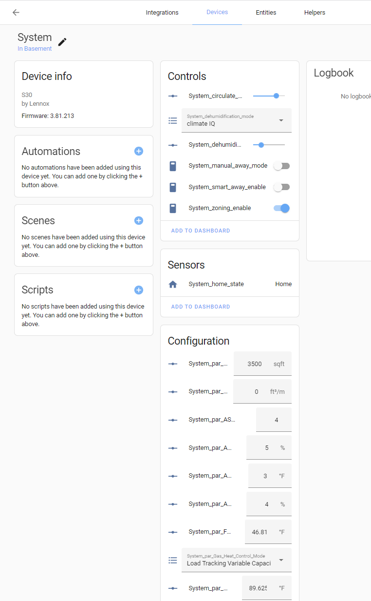
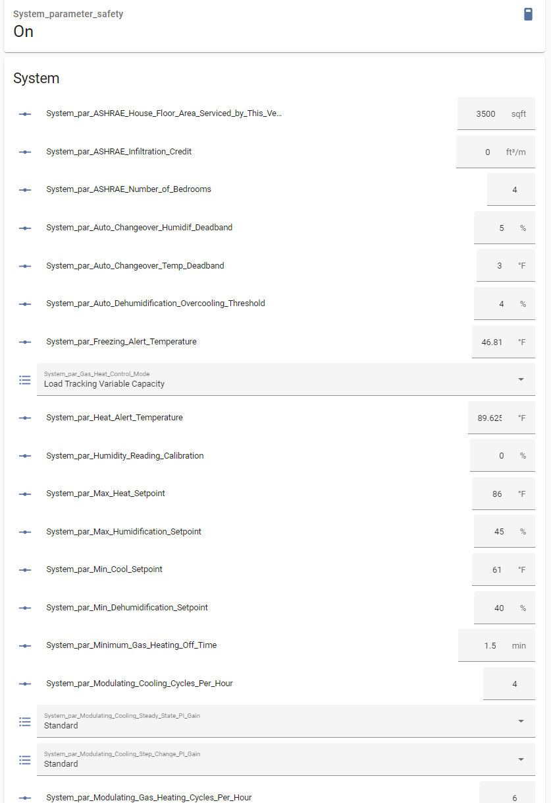
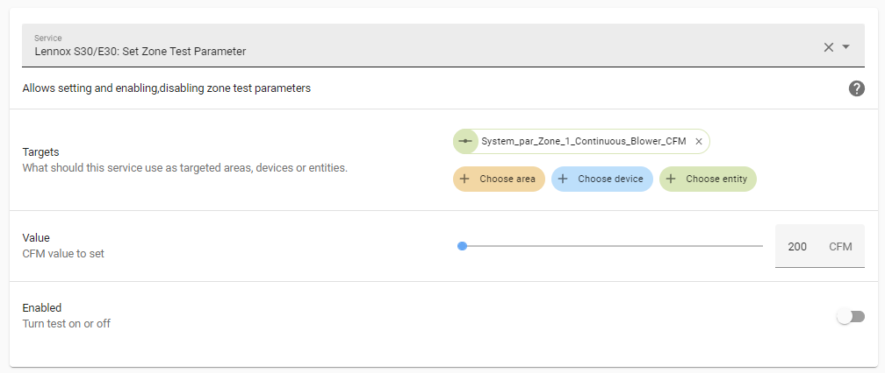

# Lennox S30 Equipment Parameters Beta

**WARNING** improperly setting equipment parameters could render your HVAC system inoperable - please use caution and write down old values before changing and review this document.

This feature is in Beta, as we learn how to better use it, the methods and entities may change. If you use this beta, please provide feedback and your use cases.

Please raise issues and post in this discussion topic:

https://github.com/PeteRager/lennoxs30/discussions/197

## What are Equipment Parameters

Equipment Parameters are the tuning parameters for your HVAC system. They are also settable from the Lennox Panel in Settings / Advanced Settings / Dealer Control Panel / Equipment.

## How does it work and not work?

There is some varying behavior that we are trying to understand, as not all equipment parameters seems to function the same.

When some equipment parameters are set via the S30 Dealer Control Panel, the systems goes through a Test cycle - which pauses the current HVAC cycle and then resumes the HVAC cycle. This process typically takes 1 minute 3 seconds. You may want to experiment using the panel first.

Like when parameters are set via the Integration, the system goes through a Test cycle. Sometimes, this process takes **4 minutes** before the panel become operable! Please do not panic when this happens (like I did). You can always reset the panel by power cycling the S30 (using the breaker.) We did find a special command, that seems to accelerate this and created a Button entity.

Part of what we need to figure out is how the different parameters behave and when to use the button.

## How to Enable

Go into the integration configuration and check the "BETA - Equipment Parameters" option and reload the integration

You may want to enable message logging so that message are captured if problems are encountered.

https://github.com/PeteRager/lennoxs30#reporting-bugs

## Entities Created

There are two type of entities created; Number Entities for numeric parameters like CFM, Temp Offset, etc; Select Entities for parameters that have different options (on/off, timed/continous, etc.) The entities are created under the devices and are categorized as Configuration.

Here's an example of the entities created under the main S30 device. Not all devices have parameters.

Parameters in Lovelace

## Entities

### Switch Parameter Safety

switch.\<systemname\>\_parameter_safety

In order to prevent accidental setting of parameters, a parameters safety switch is created.

When the switch is on (its default), attempts to set parameters will be rejected. When the switch is off parameters can be set. The safety will automatically turn back on after 60 seconds.

### Button Parameter Update

Button.\<systemname\>\_Parameter_Update

After setting parameters, if the system goes through at 4 minute testing cycle, then you may want to use this button to accelerate the process. During system test, we saw that setting the parameter and then pressing the button made the S30 go through its standard 1 minute testing cycle.

### Number Parameters

Number.\<systemName\>\_par\_\<ParameterName\>

Number entities are created for numeric equipment parameters. The limits on the parameters should be the same as the S30 panel as well as the increment.

### Select Parameters

Select.\<systemName\>\_par\_\<ParameterName\>

Select entities are created for numeric equipment parameters. The selections available should be the same as the S30 panel.

## Services

### Set Zone Test Parameter

This service places a Zoning parameters into Test Mode allowing you to manipulate the Zone CFM directly. This is only supported for Zone Systems and only supports the Zoning CFM Parameters for Blower, Heating, Cooling. The service takes the following parameters:

1. Entity Id - The equipment parameter number entites for the Zone CFM parameter to target
2. Value - The value to set the parameter to
3. Enable - Turns zone testing on or off for this parameter

Note: It is unclear what happens when Zone Testing is left on for a while. It is possible the blower keeps going regardless of the HVAC cycle?

Note: Make sure you disable zone testing by callnig the service with enable = False when done.

## Known Parameters Behaviors

| Parameter                                        | Description                                                 | Behavior                                                                            | Nontes |
| ------------------------------------------------ | ----------------------------------------------------------- | ----------------------------------------------------------------------------------- | ------ |
| number.\_par_iu_continuous_indoor_blower_airflow | Sets the blower CFM when the Fan is On or in Circulate Mode | Puts system into 4 minute test cycle or 1 minute with parameter update button press | None   |
